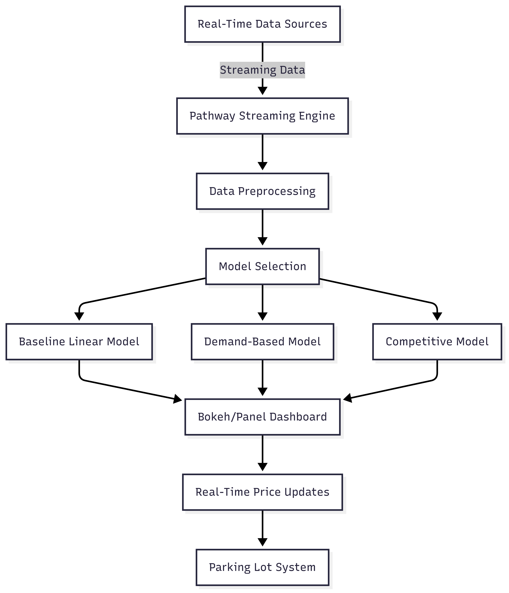

# Dynamic Pricing for Urban Parking Lots

## Project Overview
This project develops a **dynamic pricing engine** for urban parking lots, leveraging real-time streaming data and behavioral demand features to optimize pricing strategies. The goal is to maximize revenue and parking space utilization by dynamically adjusting prices based on demand, occupancy, and competitive factors. The system processes streaming data to provide real-time pricing recommendations using three distinct models:

1. **Baseline Linear Model**: A simple model using static features like time of day and location.
2. **Demand-Based Model**: Incorporates real-time demand signals, such as occupancy rates and user behavior.
3. **Competitive Model**: Considers pricing strategies of nearby parking lots to stay competitive.

This project was developed as part of the **Summer Analytics 2025 Capstone Project**.

## Tech Stack
- **Programming Language**: Python
- **Libraries and Frameworks**:
  - **Pathway**: For real-time data streaming and processing.
  - **Bokeh**: For interactive data visualization.
  - **Pandas**: For data manipulation and analysis.
  - **NumPy**: For numerical computations.
  - **Panel**: For building interactive dashboards.
- **Environment**: Jupyter Notebook (Google Colab-compatible)
- **Visualization**: Bokeh for real-time dashboard updates.
- **Dependencies**: Installed via pip (e.g., `pathway`, `bokeh`, `panel`).

## Architecture Diagram
Below is the architecture diagram of the dynamic pricing system:

## Project Architecture and Workflow
### Architecture
The system is designed to handle real-time data streams and produce dynamic pricing recommendations. The architecture consists of the following components:

1. **Data Ingestion**:
   - Real-time data (e.g., occupancy rates, time of day, nearby parking lot prices) is ingested using the **Pathway** streaming engine.
   - Data sources include sensors in parking lots, external APIs for competitor pricing, and historical booking patterns.

2. **Data Preprocessing**:
   - Raw streaming data is cleaned and transformed into features suitable for modeling.
   - Features include temporal data (hour, day), spatial data (location), occupancy rates, and competitor pricing.

3. **Model Selection and Processing**:
   - The system supports three models:
     - **Baseline Linear Model**: Uses static features (e.g., time, location) to predict prices using a linear regression approach.
     - **Demand-Based Model**: Incorporates real-time demand metrics (e.g., occupancy rate, booking frequency) to adjust prices dynamically.
     - **Competitive Model**: Analyzes competitor pricing and adjusts prices to remain competitive while maximizing revenue.
   - Models are implemented using Python and leverage Pathway for real-time computation.

4. **Visualization and Output**:
   - The **Bokeh** and **Panel** libraries are used to create an interactive dashboard displaying real-time pricing, occupancy, and system performance metrics.
   - The dashboard includes latency metrics and logs, as shown in the Pathway Progress Dashboard output.

5. **Integration**:
   - Pricing recommendations are sent to the parking lot management system for implementation.
   - The system supports continuous updates as new data streams in.

### Workflow
1. **Data Collection**: Real-time data is collected from parking lot sensors and external APIs.
2. **Streaming Processing**: Pathway processes the data stream, applying transformations and feeding features into the models.
3. **Model Execution**: The three models (Baseline, Demand-Based, Competitive) run in parallel or sequentially, depending on the configuration.
4. **Visualization**: The Bokeh/Panel dashboard updates in real-time, showing pricing, latency, and system logs.
5. **Feedback Loop**: Pricing decisions are implemented, and their impact (e.g., occupancy changes) is fed back into the system for continuous learning.

